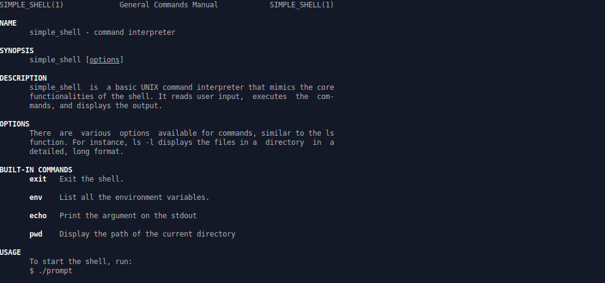
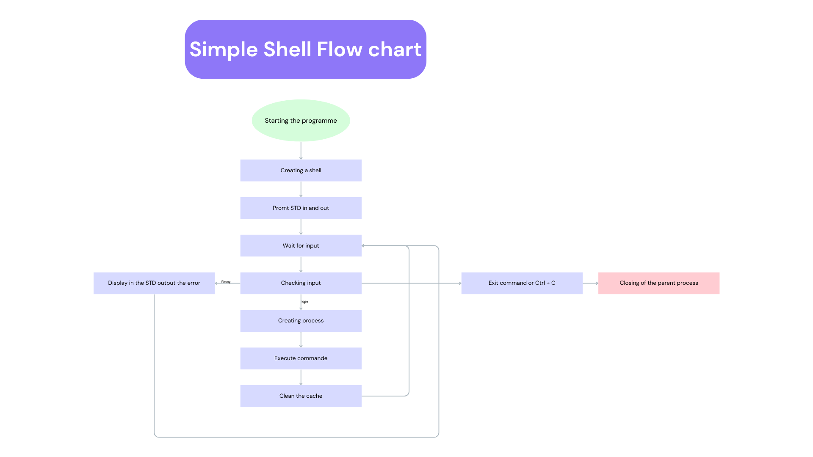

# Simple Shell

## Description

This project is a simple UNIX command interpreter that replicates functionalities of the simple shell (sh). It can be used both in interactive and non-interactive mode.

## Requirements

### General

- Allowed editors: `vi`, `vim`, `emacs`
- All files will be compiled on Ubuntu 20.04 LTS using `gcc`, with the options `-Wall -Werror -Wextra -pedantic -std=gnu89`
- All files should end with a new line
- A `README.md` file, at the root of the folder of the project is mandatory
- Code should use the Betty style. It will be checked using `betty-style.pl` and `betty-doc.pl`
- The shell should not have any memory leaks
- No more than 5 functions per file
- All header files should be include guarded
- Use system calls only when necessary

### GitHub

- There should be one project repository per group. Cloning/forking a project repository with the same name before the second deadline risks a 0% score.

### Output

- Unless specified otherwise, the program must have the exact same output as `sh` (/bin/sh) as well as the exact same error output.
- The only difference is when printing an error, the name of the program must be equivalent to `argv[0]`.

### List of allowed functions and system calls

- All functions from `string.h`
- `access` (man 2 access)
- `chdir` (man 2 chdir)
- `close` (man 2 close)
- `closedir` (man 3 closedir)
- `execve` (man 2 execve)
- `exit` (man 3 exit)
- `_exit` (man 2 _exit)
- `fflush` (man 3 fflush)
- `fork` (man 2 fork)
- `free` (man 3 free)
- `getcwd` (man 3 getcwd)
- `getline` (man 3 getline)
- `getpid` (man 2 getpid)
- `isatty` (man 3 isatty)
- `kill` (man 2 kill)
- `malloc` (man 3 malloc)
- `open` (man 2 open)
- `opendir` (man 3 opendir)
- `perror` (man 3 perror)
- `printf` (man 3 printf)
- `fprintf` (man 3 fprintf)
- `vfprintf` (man 3 vfprintf)
- `sprintf` (man 3 sprintf)
- `putchar` (man 3 putchar)
- `read` (man 2 read)
- `readdir` (man 3 readdir)
- `signal` (man 2 signal)
- `stat` (__xstat) (man 2 stat)
- `lstat` (__lxstat) (man 2 lstat)
- `fstat` (__fxstat) (man 2 fstat)
- `strtok` (man 3 strtok)
- `wait` (man 2 wait)
- `waitpid` (man 2 waitpid)
- `wait3` (man 2 wait3)
- `wait4` (man 2 wait4)
- `write` (man 2 write)

### Compilation

Your shell will be compiled this way:

```sh
gcc -Wall -Werror -Wextra -pedantic -std=gnu89 *.c -o hsh
```

### Testing

Your shell should work like this in interactive mode:

```sh
prompt:/# ./hsh
($) /bin/ls
hsh main.c shell.c
($)
($) exit
prompt:/#
```

But also in non-interactive mode:

```sh
prompt:/# echo "/bin/ls" | ./hsh
hsh main.c shell.c test_ls_2
prompt:/# cat test_ls_2
/bin/ls
/bin/ls
prompt:/# cat test_ls_2 | ./hsh
hsh main.c shell.c test_ls_2
hsh main.c shell.c test_ls_2
prompt:/#
```

### Checking for Memory Leaks

To check for memory leaks, you can use `valgrind`:

```sh
valgrind --leak-check=full --show-leak-kinds=all --track-origins=yes --verbose ./hsh
```

## Man page

Man pages are simply manual pages created to help users understand how commands are used in Linux.

### Using man page

```sh
man <what you want>
```

### Our man page



## Flowchart



## Authors

This project was completed by Jonas and Mathis

----------

<div style="display: flex; align-items: center; gap: 10px;">
  <a href="https://www.linkedin.com/in/jonas-jungling">
    
  </a>
  <span style="margin-left: 10px; margin-right: 20px;">Jonas Jungling</span>
  <a href="https://www.linkedin.com/in/mathis-bermond-619674260">
    
  </a>
  <span style="margin-left: 10px; margin-right: 20px;">Mathis Bermond</span>
</div>
